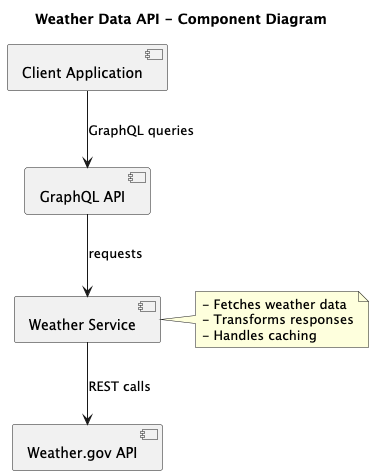

# Real-Time Weather Data API

A GraphQL-based API service that provides summarized weather data by integrating with the National Weather Service API (weather.gov).

## Overview

This service acts as a middleware that fetches data from the National Weather Service API, processes it, and exposes it through a GraphQL interface, making it easier to query specific weather information in a more flexible way.

## Architecture

The system follows a simple, straightforward design:



View the source PlantUML diagram: [compo-diagram.puml](documentation/compo-diagram.puml)

## Technical Stack

- **Java Spring Boot**: Core framework
- **GraphQL**: API query language
- **Gradle**: Build tool and dependency management
- **Spring WebFlux**: (Recommended) For reactive programming with the external API
- **JUnit**: Testing framework

## Features

- GraphQL API endpoint for weather data queries
- Integration with National Weather Service API (weather.gov)
- Data summarization and transformation
- Flexible query capabilities
- Caching support for improved performance

## Setup and Installation

1. Clone the repository
2. Ensure you have JDK 17 or later installed
3. Build the project:
   ```bash
   ./gradlew build
   ```
4. Run the application:
   ```bash
   ./gradlew bootRun
   ```

## API Documentation

### GraphQL Endpoint

The GraphQL endpoint will be available at: `http://localhost:8080/graphql`

### Sample Queries

```graphql
# Get current weather conditions by coordinates
query {
  currentWeather(latitude: 39.7456, longitude: -97.0892) {
    temperature {
      value
      unit
    }
    humidity
    windSpeed
    windDirection
    description
    timestamp
  }
}

# Get detailed forecast
query {
  forecast(latitude: 39.7456, longitude: -97.0892) {
    periods {
      name
      temperature
      temperatureUnit
      windSpeed
      windDirection
      shortForecast
      detailedForecast
    }
  }
}

# Get weather alerts for an area
query {
  alerts(latitude: 39.7456, longitude: -97.0892) {
    headline
    severity
    urgency
    description
    instruction
    areas
    effective
    expires
  }
}

# Get summarized weather data
query {
  weatherSummary(latitude: 39.7456, longitude: -97.0892) {
    current {
      temperature
      conditions
    }
    dailyForecast {
      date
      high
      low
      conditions
      precipitationChance
    }
    activeAlerts {
      type
      severity
      headline
    }
  }
}
```

## Weather.gov API Integration

This service integrates with the National Weather Service API (https://api.weather.gov/). Key endpoints used include:

- Points API: `/points/{latitude},{longitude}`
- Forecast API: `/gridpoints/{wfo}/{x},{y}/forecast`
- Observations API: `/stations/{stationId}/observations/latest`

## Development Guidelines

1. Follow Spring Boot best practices
2. Write unit tests for new features
3. Document GraphQL schemas
4. Handle API rate limits and caching
5. Implement error handling for external API calls

## Configuration

Key application properties can be configured in `src/main/resources/application.properties`:

```properties
server.port=8080
weather.api.base-url=https://api.weather.gov
weather.api.cache-duration=300
```

## Error Handling

The service implements comprehensive error handling for:
- Weather.gov API connectivity issues
- Invalid coordinates/locations
- Rate limiting
- Data transformation errors

## Contributing

1. Fork the repository
2. Create a feature branch
3. Commit changes
4. Push to the branch
5. Create a Pull Request

## License

This project is licensed under the MIT License - see the LICENSE file for details.
